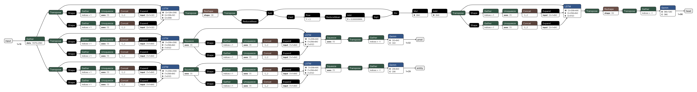

# Model Overview:

    Model FFM was created to infer labels from client provided files.

## Model Architecture:
    
   BiLSTMs and LSTM proved useful for the task at hand. So a `deep learning`
   based model was the desired architecture. BERT word tokenizer was used to
   tokenize training corpus. The model was trained with multiclass, multilabel
   classification as the objective. The trained model was ported to a ONNX
   compatible object after training.
   
   


## Model Performance Metrics:

    A custom metric was used to evaluate the model performace and prune the
    models. `EMR` or Exact Match Ratio is the ratio of triplet match to the
    overall predictions.`Cross-entropy` was used as the desired loss function
    for model training purposes.

# Data:

    Data was scrapped from multiple client provided documents and feedbacks
    over years. Training corpus consists of `11283` examples, of which `1200`
    where used for testing and `5000` was for validation and 10 fold cv. The
    desired targets: Header, Product, Entity consists of the following labels:

    - Header labels: "{63: 'NumWorkingHoursWeek', 26: 'DateOfBirth', 36:
      'FirstName', 41: 'Gender', 55: 'LastName', 75: 'Salary', 7: 'Age', 66:
      'Premium', 43: 'GenericInd', 32: 'EligibilityInd', 30: 'EffectiveDate',
      83: 'TerminationDate', 87: 'UNK', 23: 'CoverageTier', 0:
      'AccountNumber', 12: 'BenefitAmount', 2: 'Address', 3: 'AddressLine1',
      16: 'BinaryResponse', 19: 'Carrier', 1: 'Action', 65: 'PlanCode', 33:
      'EmploymentStatus', 42: 'GenericDate', 92: 'Zip', 4: 'AddressLine2', 21:
      'Country', 5: 'AddressLine3', 6: 'AdjustDeductAmt', 51: 'Inforce
      Amount', 13: 'BenefitClass', 25: 'CurrencySalary', 22: 'CoverageAmount',
      37: 'FullName', 15: 'BillingDivision', 64: 'PhoneNumber', 46:
      'GroupNumber', 14: 'BenefitPercentage', 74: 'SSN', 59: 'MiddleInitial',
      73: 'Relationship', 11: 'BeneficiaryType', 68: 'Product', 85:
      'TimeFreq', 31: 'EligGroup', 54: 'JobTitle', 62: 'NumDependents', 29:
      'EOI_Amount', 39: 'GF_Indicator', 47: 'GuaranteeIssueInd', 38:
      'GF_BenefitAmount', 67: 'PremiumFreq', 70: 'Provider', 90:
      'WaiveReason', 20: 'City', 84: 'TerminationReasonCode', 61:
      'NotesOrDesc', 88: 'USCounty', 24: 'Covered Payroll', 48: 'HireDate',
      28: 'DriversLicense', 60: 'MiddleName', 80: 'State', 27:
      'DisabilityInd', 86: 'TobaccoUserOrSmokerInd', 49: 'IDType', 79:
      'SeqNumber', 94: 'emailAddress', 77: 'SalaryFreq', 53: 'InforceInd', 82:
      'TaxStatus', 45: 'Grandfathered Amount', 71: 'Reason', 57:
      'MaritalStatus', 76: 'SalaryEffectiveDate', 72: 'RehireDate', 89:
      'Units', 91: 'WorkLocation', 8: 'AgeGroup', 34: 'FLSAStatus', 35:
      'FSAamount', 18: 'COVERAGEAMOUNT', 17: 'COVERAGE AMOUNT', 9:
      'Alt_IdentityNumber', 44: 'Generic_ID', 58: 'MemberID', 50:
      'IdentityNumber', 78: 'SecondaryAccountNumber', 52: 'InforceAmount', 40:
      'GI_Amount', 93: 'effectivedate', 95: 'terminationdate', 81:
      'TERMINATIONDATE', 69: 'ProductPlanNameOrCode', 10: 'Applied For
      Amount', 56: 'Location'}"

    - Product labels: " {30: 'UNK', 19: 'LIFE', 0: 'ACC', 1: 'ADD', 5:
      'ASOFEE', 28: 'STD', 18: 'HEALTH', 14: 'DEN', 13: 'CRIT', 9: 'CIW', 15:
      'DEPLIFE', 2: 'ADD LIFE', 22: 'LTD', 6: 'CHADD', 8: 'CHLIFE', 7:
      'CHCRIT', 10: 'COBRA', 31: 'VIS', 12: 'COBRAVIS', 25: 'SPCRIT', 11:
      'COBRADEN', 16: 'EAPFEE', 21: 'LIFEVOL', 4: 'ADDVOL', 3: 'ADDSUP', 20:
      'LIFESUP', 24: 'SPADD', 26: 'SPLIFE', 29: 'STDVOL', 23: 'LTDVOL', 17:
      'FMLA', 27: 'STADD'}"

    - Entity labels: "{26: 'Primary', 27: 'Spouse', 28: 'UNK', 10: 'Child',
      18: 'Dependent', 0: 'Beneficiary-1', 1: 'Beneficiary-2', 2:
      'Beneficiary-3', 25: 'Employer', 5: 'CB-1', 6: 'CB-2', 19:
      'Dependent-1', 20: 'Dependent-2', 21: 'Dependent-3', 22: 'Dependent-4',
      23: 'Dependent-5', 24: 'Dependent-6', 11: 'Child-1', 12: 'Child-2', 13:
      'Child-3', 14: 'Child-4', 15: 'Child-5', 16: 'Child-6', 3:
      'Beneficiary-4', 4: 'Beneficiary-5', 7: 'CB-3', 8: 'CB-4', 9: 'CB-5',
      17: 'Child-7'}"

## Pre-Processing Methods Used:

    Text Corpus was preprocessed by humanizing and cleaning up symbols. The
    data was then processed using `BertWordPieceTokenizer`, which tokenizes,
    flips letters to lowercase, strip accent markers and adds special tokens
    like [PAD], [CLS], [SEP], ['UNK'] and ['MASK']. The final preprocessed
    data was then converted to Pytorch tensors with no sharding.

## Features Used:

- Expects `Column Header`.

# Predict Function:

    ** contains client specific post-processing code.

## Input Schema:

```
predict(
         model_name="model_ffm",
         artifacts=["data/bert_wp_tok_updated_v2.joblib"],
         model_path="data/FFM_new_prod_labels_v2.h5",
         inputs={"datasetId": "spr:dataset_id", "columns": columns},
     )
```

## Response Schema: 

```
[
        {
            "inputDataSource": f"{dataset_id}:0",
            "entityId": f"{dataset_id}",
            "predictedResult": [{'input_col': [('prod prediction', pred_confidence), ('header prediction', pred_confidence), ('entity prediction', pred_confidence)]}],
        }
    ]
```

____
