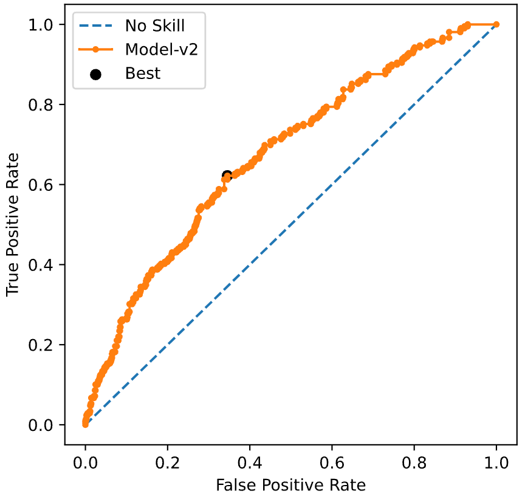

# Model Overview:

    Model application siu was created to flag inconsistent transctions by
    looking at user data.

## Model Architecture:

    For the task of classification with a highly imbalanced dataset `Gradient
    Boosted Trees` proved to be effecient. A `lightgbm` model was choosen from
    a pool of catboost, xgboost and lgb models. The model was trained with
    binary classification as its objective. The trained model was binarized
    and serilized.

## Parameters of LGBM:
    
    - learning_rate= 0.02408251540678558,
    - n_estimators=350,
    - metric= 'auc',
    - num_leaves= 60,
    - max_depth= -1, 
    - max_bin = 260,
    - min_data_in_leaf= 90,  
    - feature_fraction= 0.6, 
    - bagging_freq = 1,   
    - bagging_fraction = 0.6, 
    - lambda_l2 = 10, 
    - lambda_l1 = 0,   
    - scale_pos_weight=2

## Feature Importance of model:


## Model Performance Metrics:

- 'confusion_matrix_data': [524, 249], [88, 121]], 
- 'class0_precision': 0.856, 
- 'class0_recall': 0.678, 
- 'class0_f1-score': 0.757, 
- 'class1_precision': 0.327, 
- 'class1_recall': 0.579, 
- 'class1_f1-score': 0.418, 
- 'weighted_avg_precision': 0.744, 
- 'weighted_avg_recall': 0.657, 
- 'weighted_avg_f1-score': 0.685, 
- 'overall_accuracy': 0.657, 
- 'F05': 0.358, 
- 'F1': 0.418, 
- 'F2': 0.502, 
- 'precision': 0.327, 
- 'recall': 0.579, 
- 'auc': 0.628, 
- 'aucpr': 0.359



# Data:

    Data contains only issue transaction data and application data with
    transactions filtered out. 

- Data size: 3272
- Train/test/val ratio: 70%/30%/5 fold cross val of train split (70*0.10*5)
- Train data location:

  (https://fineos-my.sharepoint.com/:x:/p/mohamedt/EbGNtcHEgtdDprad9sBbgfQBah6NBGQgQynzLc2L3RzSdg?e=ouxX93)

- Preprocessed train template:

  (https://fineos-my.sharepoint.com/:x:/p/mohamedt/ERy_LsNNJJpJq6sOeZ8cSKcBRAgohRt6H2a293VX7fQwGg?e=qhHvqC)

- Target: Actual Disposition From client feedback.

## Pre-Processing Methods Used:

- NaN imputation for ['uc2_employee_ratio', 'uc7_employee_ratio',
  'uc8_employee_ratio', 'uc8_employee_mean_change_days']: -1
- NaN imputation for ['NBPAYMENTSDATA_PREMIUMTYPE_CODE',
  'NBANNUITYDATA_PURPOSEOFACCOUNT_VALUE', 'NBPAYMENTSDATA_METHOD']: "['UNK']"
- NaN imputation for ['NBAGENTDATA_ISPRIMARY_VALUE',
  'FINANCIALGOALSDATA_EXPECTEDSURRPENALTY_CODE',
  'FINANCIALGOALSDATA_REVERSEMORTGAGE_CODE']: 'Blank'
- History of all employee ids where processed into features and is encoded for
  in test dataset: ['160frx', '160mrx', '162blx', '470FJX', '470bmx', '470bpx',
  '470ckx', '470ddx', '470djl', '470fnx', '470fsx', '470grw', '470kax',
  '470kse', '470lcr', '470lgk', '470max', '470sce', '470tas', '470vrd',
  '470wbm', '725ccy', 'WebServices'] corresponds to ['emp_level_1',
  'emp_level_2', 'emp_level_3', 'emp_level_4', 'emp_level_5', 'emp_level_6',
  'emp_level_7', 'emp_level_8', 'emp_level_9', 'emp_level_10', 'emp_level_11',
  'emp_level_12', 'emp_level_13', 'emp_level_14', 'emp_level_15',
  'emp_level_16', 'emp_level_17', 'emp_level_18', 'emp_level_19',
  'emp_level_20', 'emp_level_21', 'emp_level_22']

- Numerical values where transformed using Quantile Transformer.

## Features Used:

  - Categorical Features : "[ "NBANNUITYDATA_APPSIGNSTATE_VALUE",
    "POLICYHDRDATA_PRODMODELID_VALUE", "NBANNUITYDATA_APPSTATUS_VALUE",
    "NBANNUITYDATA_APPSOURCE_VALUE", "APPCOVERAGESDATA_PRODMODELID_VALUE",
    "NBANNUITYDATA_OWNERPARTYTYPE_VALUE", "NBANNUITYDATA_ESIGNATUREIND_VALUE",
    "NBANNUITYDATA_OWNERANNUITANTFLAG_VALUE",
    "NBANNUITYDATA_ISREPLACEMENT_VALUE", "NBANNUITYDATA_ISGROUP_VALUE",
    "NBPAYMENTSDATA_PREMIUMTYPE_CODE", "NBANNUITYDATA_ANNUITYPOLICYOPTION",
    "NBANNUITYDATA_COMMOPTIONTYPE_VALUE", "NBANNUITYDATA_ANNUITYPOLICYTYPE",
    "NBANNUITYDATA_ADEQUATEASSETS_VALUE",
    "NBANNUITYDATA_PURPOSEOFACCOUNT_VALUE", "NBPAYMENTSDATA_METHOD",
    "NBANNUITYDATA_SYSTEMATICWITHDRAWAL_VALUE",
    "NBANNUITYDATA_CHECKFORMS_VALUE", "NBANNUITYDATA_ROLLOVER_VALUE",
    "NBANNUITYDATA_QUALIFIED_VALUE", "NBAGENTDATA_ISPRIMARY_VALUE",
    "CASEHDRDATA_ISGROUP_VALUE", "CASEHDRDATA_STATUS_VALUE",
    "CASEHDRDATA_UNDERWRITINGSTATUS_VALUE",
    "FINANCIALGOALSDATA_EXPECTEDSURRPENALTY_CODE",
    "FINANCIALGOALSDATA_REVERSEMORTGAGE_CODE",
    "CASEHDRDATA_ESIGNATUREIND_VALUE",
    "FINANCIALGOALSDATA_ADEQUATEASSETS_VALUE", ]"
  
  - Numeric Features : "['FINANCIALGOALSDATA_SUITABILITYSCORE',
    'uc2_employee_flag', 'uc2_employee_total_policy_count',
    'uc2_employee_policy_value', 'uc7_employee_ratio', 'uc8_employee_flag',
    'POLICYCOVHDRDATA_ISSUEAGE', 'NBPAYMENTSDATA_FORMATAMOUNT',
    'NBAGENTDATA_PERCENTAGE', 'NBANNUITYDATA_CHARGESINCURREPLACE',
    'NBANNUITYDATA_CASHWITHAPP', 'NBPAYMENTSDATA_COMMISSIONRETAINED',
    'NBREPLACEMENTINFODATA_ESTIMATEDVALUE', 'NBANNUITYDATA_EXPECTEDPREM',
    'TRXHDRDATA_PROCESSEDDATEdiff', 'POLICYCOVHDRDATA_ISSUEDATEdiff',
    'NBANNUITYDATA_APPSIGNDATEdiff',
    'NBREPLACEMENTINFODATA_PAPERWORKRECEIVEDDATEdiff',
    'APPBENEFITDATA_STARTDATEdiff', 'CASEHDRDATA_DATEISSUEDdiff',
    'CASEHDRDATA_DATERECEIVEDdiff', 'CASEHDRDATA_EAPPDATARECEIVEDdiff',
    'CASEHDRDATA_TIMESTAMPdiff', 'FINANCIALGOALSDATA_TIMESTAMPdiff',
    'no_employees', 'NBANNUITYDATA_ANNUITYPOLICYOPTION_SPDA',
    'V_SYSTEM_LOGON_ID']"

  - Bool Features : "['emp_level_1', 'emp_level_2', 'emp_level_3',
    'emp_level_4', 'emp_level_5', 'emp_level_6', 'emp_level_7', 'emp_level_8',
    'emp_level_9', 'emp_level_10', 'emp_level_11', 'emp_level_12',
    'emp_level_13', 'emp_level_14', 'emp_level_15', 'emp_level_16',
    'emp_level_17', 'emp_level_18', 'emp_level_19', 'emp_level_20',
    'emp_level_21', 'emp_level_22']"

# Predict Function(if available):

## Input Schema:

```
predict(
         model_name="SIU_TXN_model_v5",
         artifact=[
             {
                 "dataName": "combined_artifacts",
                 "dataType": "artifact",
                 "dataValue": "s3://siutempbucket/tariq/combined_appn_siu_c_v5.sav",
                 "dataValueType": "str",
             }
         ],
         inputs={
             "claim": {<check predict function for example claim>}
             }
             )

```


## Response Schema: 

```
[
        {
            "inputDataSource": f"RANDN1209:0",  # temporarily present for payload schema restriction
            "entityId": 'RAND1209',  # temporarily present for payload schema restriction
            "predictedResult": [],
        }
    ]
```

____
