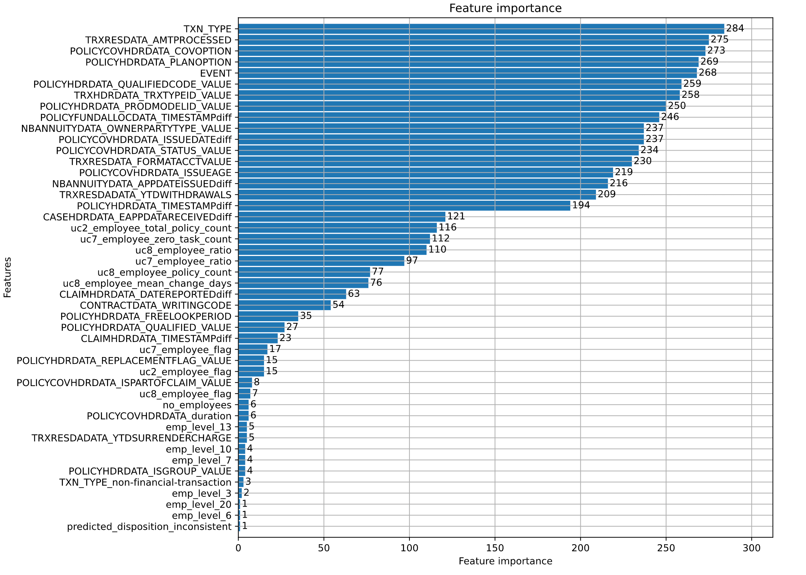
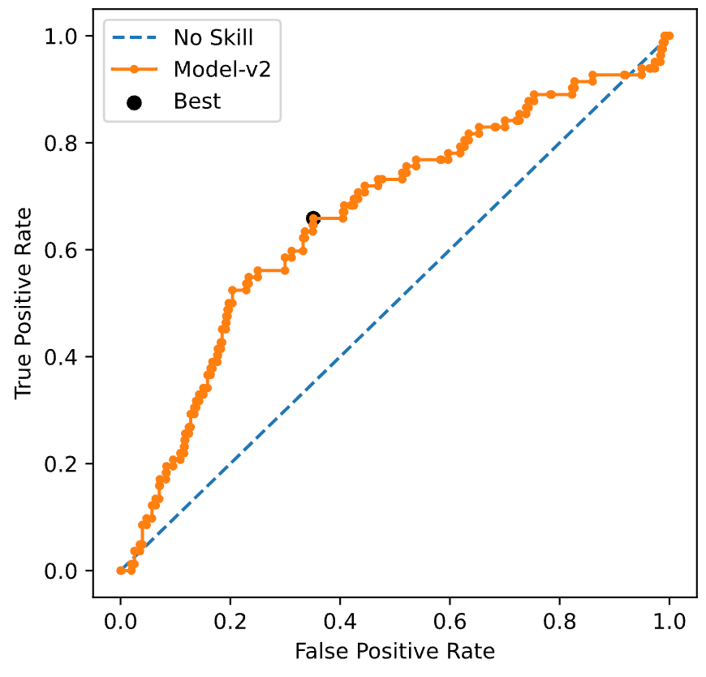

# Model Overview:

    Model transaction siu was created to flag inconsistent transctions by
    looking at user data.

## Model Architecture:

    For the task of classification with a highly imbalanced dataset `Gradient
    Boosted Trees` proved to be effecient. A `lightgbm` model was choosen from
    a pool of catboost, xgboost and lgb models. The model was trained with
    binary classification as its objective. The trained model was binarized
    and serilized.

## Parameters of LGBM:
    
    - learning_rate= 0.05408251540678558,
    - n_estimators=330,
    - metric= 'auc',
    - num_leaves= 50,
    - max_depth= -1, 
    - max_bin = 150,
    - min_data_in_leaf= 70,  
    - min_gain_to_split = 16.160061107266507, 
    - feature_fraction= 0.3, 
    - bagging_freq = 1,   
    - min_child_weight = 10, 
    - bagging_fraction = 0.7, 
    - lambda_l2 = 10, 
    - lambda_l1 = 0,   
    - scale_pos_weight=12

## Feature Importance of model:



## Model Performance Metrics:

- 'confusion_matrix_data': [[603, 305], [31, 51]], 
- 'class0_precision': 0.951, 
- 'class0_recall': 0.664, 
- 'class0_f1-score': 0.782, 
- 'class1_precision': 0.143, 
- 'class1_recall': 0.622, 
- 'class1_f1-score': 0.233, 
- 'weighted_avg_precision': 0.884, 
- 'weighted_avg_recall': 0.661, 
- 'weighted_avg_f1-score': 0.737, 
- 'overall_accuracy': 0.661, 
- 'F05': 0.169, 
- 'F1': 0.233, 
- 'F2': 0.373, 
- 'precision': 0.143, 
- 'recall': 0.622, 
- 'auc': 0.643, 
- 'aucpr': 0.137



# Data:

    Data contains only transaction data with applications and issue
    transactions filtered out. 

- Data size: 3300
- Train/test/val ratio: 70%/30%/5 fold cross val of train split (70*0.10*5)
- Train data location:

  (https://fineos-my.sharepoint.com/:x:/p/mohamedt/EQ1zDuf6mKtJnCuQz51uonUBa66gYlGq0d478TyUMdZJwQ?e=ilybbo)
- Preprocessed train template:

  (https://fineos-my.sharepoint.com/:x:/p/mohamedt/EQ1zDuf6mKtJnCuQz51uonUBa66gYlGq0d478TyUMdZJwQ?e=OTODpx)

- Target: Actual Disposition From client feedback.

## Pre-Processing Methods Used:

- NaN imputation for ['uc8_employee_mean_change_days', 'uc7_employee_ratio',
  'uc8_employee_ratio']: -1
- NaN imputation for ['CONTRACTDATA_WRITINGCODE']: "['Unknown']"
- NaN imputation for ['NBANNUITYDATA_OWNERPARTYTYPE_VALUE']: 'Unknown'
- Extracting data from ['CONTRACTDATA_WRITINGCODE'] column:
  `df['CONTRACTDATA_WRITINGCODE'].map(lambda x: eval(x)[0])`
- History of all employee ids where processed into features and is encoded for
  in test dataset: ['470kjr', '470mkx', '470mex', '470whx', '470jax',
  '470srl', '725dpl', '470gtc', '303dwk', '470qda', '470hcl', '163fax',
  '470fbd', '470bpx', '470tbf', '725rtr', '205tdx', '302wrw', '110btw',
  'WebServices', '470knx'] corresponds to ['emp_level_1', 'emp_level_2',
  'emp_level_3', 'emp_level_4', 'emp_level_5', 'emp_level_6', 'emp_level_7',
  'emp_level_8', 'emp_level_9', 'emp_level_10', 'emp_level_11',
  'emp_level_12', 'emp_level_13', 'emp_level_14', 'emp_level_15',
  'emp_level_16', 'emp_level_17', 'emp_level_18', 'emp_level_19',
  'emp_level_20']

- Numerical values where scaled using Robust Scaler.

## Features Used:

  - Categorical Features : "{'CONTRACTDATA_WRITINGCODE',
    'TRXHDRDATA_TRXTYPEID_VALUE', 
    'POLICYHDRDATA_PRODMODELID_VALUE', 'EVENT',
    'POLICYHDRDATA_PLANOPTION', 'POLICYHDRDATA_QUALIFIEDCODE_VALUE',
    'POLICYCOVHDRDATA_COVOPTION', 'POLICYCOVHDRDATA_STATUS_VALUE',
    'NBANNUITYDATA_OWNERPARTYTYPE_VALUE', 'TXN_TYPE'}"
  
  - Numeric Features : "{'uc2_employee_flag',
    'uc2_employee_total_policy_count', 'uc7_employee_flag',
    'uc7_employee_zero_task_count', 'uc7_employee_ratio', 'uc8_employee_flag',
    'uc8_employee_policy_count', 
    'uc8_employee_mean_change_days',
    'uc8_employee_ratio', 'POLICYCOVHDRDATA_ISSUEAGE',
    'TRXRESDATA_FORMATACCTVALUE', 'TRXRESDADATA_YTDWITHDRAWALS',
    'TRXRESDADATA_YTDSURRENDERCHARGE', 'TRXRESDATA_AMTPROCESSED',
    'POLICYHDRDATA_FREELOOKPERIOD', 'POLICYCOVHDRDATA_RETIREMENTAGE',
    'POLICYCOVHDRDATA_ISSUEDATEdiff', 'POLICYHDRDATA_TIMESTAMPdiff',
    'CLAIMHDRDATA_DATEOFLOSSdiff', 'CLAIMHDRDATA_DATEREPORTEDdiff',
    'CLAIMHDRDATA_TIMESTAMPdiff', 'POLICYCOVHDRDATA_ENDDATEdiff',
    'POLICYCOVHDRDATA_TERMINATIONDATEdiff',
    'POLICYFUNDALLOCDATA_TIMESTAMPdiff', 'NBANNUITYDATA_APPDATEISSUEDdiff',
    'CASEHDRDATA_EAPPDATARECEIVEDdiff', 'POLICYCOVHDRDATA_duration',
    'no_employees', 'predicted_disposition_inconsistent',
    'TXN_TYPE_non-financial-transaction', 'webservices'}"

  - Bool Features : "{'POLICYHDRDATA_ISGROUP_VALUE',
    'POLICYHDRDATA_QUALIFIED_VALUE', 
    'POLICYHDRDATA_REPLACEMENTFLAG_VALUE',
    'POLICYCOVHDRDATA_ISPARTOFCLAIM_VALUE', 'emp_level_1', 'emp_level_3',
    'emp_level_4', 'emp_level_5', 'emp_level_6', 'emp_level_7', 'emp_level_8',
    'emp_level_9', 'emp_level_10', 'emp_level_11', 'emp_level_12',
    'emp_level_13', 'emp_level_14', 'emp_level_15', 'emp_level_16',
    'emp_level_17', 'emp_level_18', 'emp_level_19', 'emp_level_20'}"

# Predict Function(if available):

## Input Schema:

```
predict(
         model_name="SIU_TXN_model_v5",
         artifact=[
             {
                 "dataName": "combined_artifacts",
                 "dataType": "artifact",
                 "dataValue": "s3://siutempbucket/tariq/combined_txn_siu_c_v5.sav",
                 "dataValueType": "str",
             }
         ],
         inputs={
             "claim": {<check predict function for example claim>}
             }
             )

```


## Response Schema: 

```
[
        {
            "inputDataSource": f"RANDN1209:0",  # temporarily present for payload schema restriction
            "entityId": 'RAND1209',  # temporarily present for payload schema restriction
            "predictedResult": [],
        }
    ]
```

____
